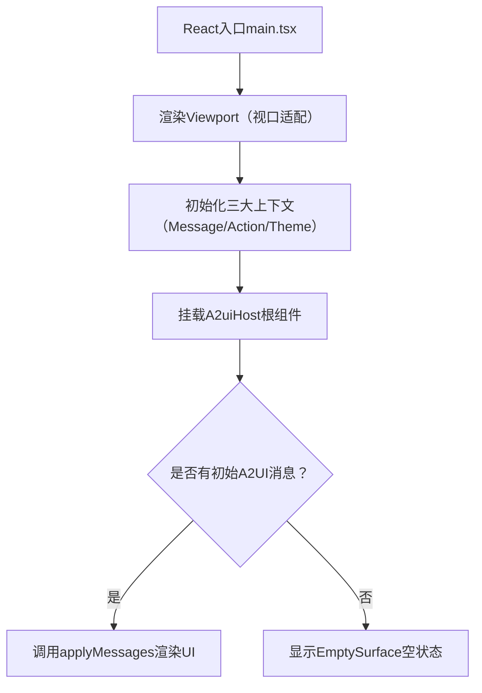
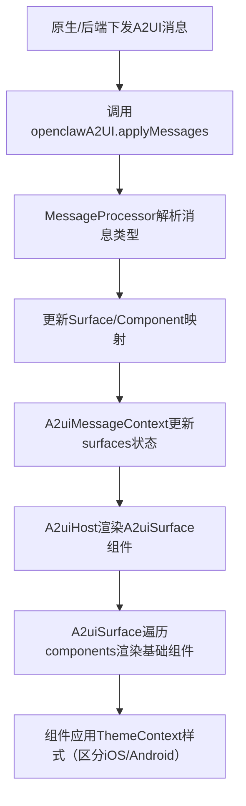
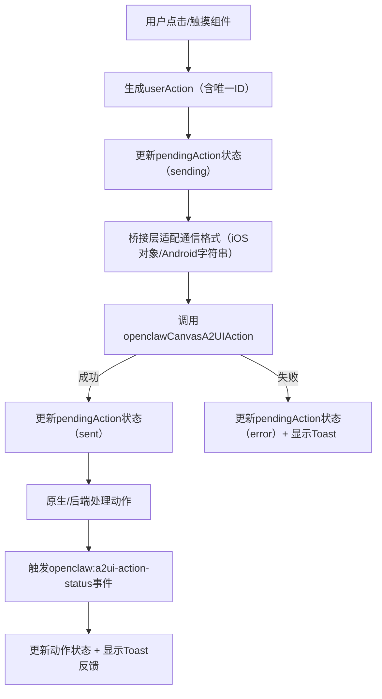

# OpenClaw H5移动端（React）开发：协议接口与功能详细设计

## 一、核心支持的协议/接口体系

基于现有`bootstrap.js`和OpenClaw Android端架构，H5移动端需兼容以下核心协议/接口，覆盖**UI渲染、交互通信、状态反馈、基础控制**四大维度：

### 1. A2UI消息协议（UI渲染驱动核心）

#### 作用

后端/原生下发结构化消息，驱动H5动态渲染UI（对应`bootstrap.js`的`applyMessages`）。

#### 接口形态

- 全局API：`openclawA2UI.applyMessages(messages: A2uiMessage[])`

- 返回值：`{ ok: boolean, surfaces: string[] }`（渲染后的Surface ID列表）

#### 消息数据结构（核心）

```JSON

[
  {
    "type": "surface.create", // 支持：surface.create/update/delete | component.create/update/delete
    "surfaceId": "main",      // 容器唯一ID
    "payload": {
      "id": "btn_submit",     // 组件唯一ID
      "type": "Button",       // 组件类型（覆盖bootstrap.js所有类型：Button/Card/Modal等）
      "props": {              // 组件属性（与主题配置匹配）
        "text": "提交",
        "action": {           // 点击触发的交互动作
          "name": "form_submit",
          "context": [        // 上下文参数（静态/动态取值）
            {
              "key": "form_id",
              "value": { "literalString": "form_001" } // 或path: "data.formId"（动态取值）
            }
          ]
        }
      }
    }
  }
]
```

#### 约束规则

- 消息必须为数组，每个消息含`type`（操作类型）、`surfaceId`（容器ID）、`payload`（组件/容器配置）；

- 组件类型需匹配A2UI标准列表（AudioPlayer/Button/Card/Column/Modal等）；

- 上下文参数支持`literalString/literalNumber/literalBoolean`（静态）或`path`（动态解析）。

### 2. 前端-原生桥接协议（交互通信核心）

#### 作用

H5组件交互（如按钮点击）触发原生/后端处理（对应`bootstrap.js`的`#handleA2UIAction`）。

#### 接口形态

- 原生桥接方法：`openclawCanvasA2UIAction.postMessage(...)`

- 核心数据结构（`userAction`）：

    ```JSON
    
    {
      "id": "a2ui_1718000000000_abc123", // 唯一动作ID（UUID/时间戳+随机数）
      "name": "form_submit",             // 动作名称
      "surfaceId": "main",               // 所属Surface ID
      "sourceComponentId": "btn_submit", // 触发组件ID
      "timestamp": "2024-06-10T12:00:00.000Z", // 时间戳
      "context": { "form_id": "form_001" } // 解析后的上下文参数
    }
    ```

#### 通信适配规则

- iOS（WebKit）：直接传递结构化`userAction`对象；

- Android：将`userAction`转为JSON字符串传递；

- 纯H5场景：对接后端接口（替换原生桥接）。

### 3. 状态通信协议（交互反馈）

#### 作用

原生/后端返回交互动作的处理状态（对应`bootstrap.js`的`openclaw:a2ui-action-status`事件）。

#### 接口形态

- 全局自定义事件：`openclaw:a2ui-action-status`

- 事件参数（detail）：

    ```JSON
    
    {
      "id": "a2ui_1718000000000_abc123", // 对应userAction的id
      "ok": true,                        // true=成功 / false=失败
      "error": ""                        // 失败时的错误信息（非空）
    }
    ```

### 4. 基础控制接口

|接口名称|作用|入参|返回值|
|---|---|---|---|
|`openclawA2UI.reset()`|清空所有Surface，重置状态|无|`{ ok: boolean }`|
|`openclawA2UI.getSurfaces()`|获取已渲染的Surface ID列表|无|`string[]`|
### 5. 主题样式协议

#### 作用

自定义A2UI组件样式（对应`bootstrap.js`的`openclawTheme`），结构如下：

```TypeScript

interface OpenClawTheme {
  components: Record<string, any>; // 组件样式（Button/Card等）
  elements: Record<string, any>;   // 原生元素样式（a/button等）
  markdown: Record<string, any>;   // Markdown样式
  additionalStyles: Record<string, any>; // 附加样式（阴影/渐变/圆角等）
}
```

#### 动态适配

支持通过CSS变量（如`--openclaw-a2ui-inset-top`）和设备检测（iOS/Android）差异化渲染样式。

## 二、React H5移动端功能详细设计

### 1. 整体架构（分层设计）

```Plain Text

┌─────────────────────────────────────────┐
│ UI组件层（React封装A2UI标准组件）        │
├─────────────────────────────────────────┤
│ 状态管理层（Action/Toast/Theme上下文）   │
├─────────────────────────────────────────┤
│ A2UI消息处理层（解析/渲染/更新）         │
├─────────────────────────────────────────┤
│ 桥接适配层（原生/后端通信适配）          │
├─────────────────────────────────────────┤
│ 基础适配层（移动端H5/样式隔离）          │
└─────────────────────────────────────────┘
```

### 2. 目录结构（React + TypeScript）

```Plain Text

src/
├── assets/            # 静态资源（图片/字体）
├── components/        # 核心组件
│   ├── A2UI/          # A2UI组件封装
│   │   ├── surfaces/  # Surface容器
│   │   │   ├── A2uiSurface.tsx  # Surface核心组件
│   │   │   └── EmptySurface.tsx # 空状态组件
│   │   ├── elements/  # A2UI基础组件（Button/Card等）
│   │   │   ├── A2uiButton.tsx
│   │   │   ├── A2uiCard.tsx
│   │   │   └── index.ts
│   │   ├── feedback/  # 反馈组件
│   │   │   ├── Status.tsx  # 操作状态提示（带Spinner）
│   │   │   ├── Toast.tsx   # 轻量提示
│   │   │   └── index.ts
│   │   └── A2uiHost.tsx    # A2UI根容器
│   ├── Bridge/        # 桥接层
│   │   ├── NativeBridge.tsx  # 原生桥接（iOS/Android）
│   │   ├── ApiBridge.tsx     # 纯H5后端桥接
│   │   └── index.ts
│   └── Layout/        # 移动端布局
│       ├── Viewport.tsx  # 视口适配
│       └── index.ts
├── context/           # React上下文
│   ├── A2uiMessageContext.tsx  # A2UI消息上下文
│   ├── ThemeContext.tsx        # 主题上下文
│   └── ActionContext.tsx       # 交互动作上下文
├── hooks/             # 自定义Hooks
│   ├── useA2uiMessages.ts  # 消息处理Hook
│   ├── useA2uiAction.ts    # 交互动作Hook
│   ├── useTheme.ts         # 主题Hook
│   └── useMobileAdapt.ts   # 移动端适配Hook
├── services/          # 服务层
│   ├── a2uiMessageProcessor.ts  # A2UI消息处理器（复刻v0_8逻辑）
│   ├── actionGenerator.ts       # userAction生成器
│   └── api/                     # 后端接口（纯H5）
│       ├── actionApi.ts         # 交互动作提交
│       └── messageApi.ts        # A2UI消息获取
├── types/             # 类型定义
│   ├── a2ui.d.ts      # A2UI消息/动作/主题类型
│   ├── bridge.d.ts    # 桥接层类型
│   └── index.d.ts
├── utils/             # 工具函数
│   ├── deviceDetect.ts  # 设备检测（iOS/Android/H5）
│   ├── uuid.ts          # actionId生成
│   └── styleParser.ts   # 样式解析
├── App.tsx            # 根组件
└── main.tsx           # 入口文件
```

### 3. 核心模块设计

#### （1）A2UI消息处理器（核心复刻）

复刻`bootstrap.js`中`SignalA2uiMessageProcessor`的逻辑，实现消息解析、Surface/Component管理：

```TypeScript

// services/a2uiMessageProcessor.ts
export class A2uiMessageProcessor {
  private surfaces = new Map<string, Surface>(); // Surface映射

  // 解析并处理A2UI消息
  processMessages(messages: A2uiMessage[]) {
    messages.forEach(msg => {
      switch (msg.type) {
        case "surface.create":
          this.createSurface(msg.surfaceId, msg.payload);
          break;
        case "component.create":
          this.createComponent(msg.surfaceId, msg.payload);
          break;
        // 其他类型（update/delete）逻辑...
      }
    });
  }

  // 创建Surface
  private createSurface(surfaceId: string, payload: any) {
    this.surfaces.set(surfaceId, { id: surfaceId, components: new Map() });
  }

  // 创建Component
  private createComponent(surfaceId: string, payload: any) {
    const surface = this.surfaces.get(surfaceId);
    if (surface) {
      surface.components.set(payload.id, payload);
    }
  }

  // 清空所有Surface
  clearSurfaces() {
    this.surfaces.clear();
  }

  // 获取Surface列表
  getSurfaces() {
    return this.surfaces;
  }

  // 解析path动态取值（上下文参数）
  getData(node: any, path: string, surfaceId?: string) {
    // 复刻bootstrap.js的path解析逻辑
    const pathSegments = path.split(".");
    let value = node;
    for (const seg of pathSegments) {
      value = value?.[seg];
    }
    return value;
  }
}
```

#### （2）React上下文设计

##### ① A2uiMessageContext（消息状态管理）

```TypeScript

// context/A2uiMessageContext.tsx
import React, { createContext, useContext, useState, useCallback } from 'react';
import { A2uiMessageProcessor } from '../services/a2uiMessageProcessor';
import type { A2uiMessage, Surface } from '../types/a2ui';

interface A2uiMessageContextType {
  surfaces: [string, Surface][];
  applyMessages: (messages: A2uiMessage[]) => { ok: boolean; surfaces: string[] };
  reset: () => { ok: boolean };
  getSurfaces: () => string[];
}

const A2uiMessageContext = createContext<A2uiMessageContextType | undefined>(undefined);

export const A2uiMessageProvider: React.FC<{ children: React.ReactNode }> = ({ children }) => {
  const processor = new A2uiMessageProcessor();
  const [surfaces, setSurfaces] = useState<[string, Surface][]>([]);

  const applyMessages = useCallback((messages: A2uiMessage[]) => {
    if (!Array.isArray(messages)) throw new Error('A2UI: 期望消息数组');
    processor.processMessages(messages);
    const newSurfaces = Array.from(processor.getSurfaces().entries());
    setSurfaces(newSurfaces);
    return { ok: true, surfaces: newSurfaces.map(([id]) => id) };
  }, [processor]);

  const reset = useCallback(() => {
    processor.clearSurfaces();
    setSurfaces([]);
    return { ok: true };
  }, [processor]);

  const getSurfaces = useCallback(() => Array.from(processor.getSurfaces().keys()), [processor]);

  return (
    <A2uiMessageContext.Provider value={{ surfaces, applyMessages, reset, getSurfaces }}>
      {children}
    </A2uiMessageContext.Provider>
  );
};

// 自定义Hook（供组件使用）
export const useA2uiMessages = () => {
  const context = useContext(A2uiMessageContext);
  if (!context) throw new Error('useA2uiMessages必须在A2uiMessageProvider内使用');
  return context;
};
```

##### ② ActionContext（交互动作+反馈管理）

管理`pendingAction`（处理中的动作）、`toast`（轻量提示），并监听`openclaw:a2ui-action-status`事件：

```TypeScript

// context/ActionContext.tsx
import React, { createContext, useContext, useState, useEffect } from 'react';
import type { PendingAction, Toast } from '../types/a2ui';

interface ActionContextType {
  pendingAction: PendingAction | null;
  toast: Toast | null;
  setPendingAction: (action: PendingAction | null) => void;
  setToast: (toast: Toast | null) => void;
}

const ActionContext = createContext<ActionContextType | undefined>(undefined);

export const ActionProvider: React.FC<{ children: React.ReactNode }> = ({ children }) => {
  const [pendingAction, setPendingAction] = useState<PendingAction | null>(null);
  const [toast, setToast] = useState<Toast | null>(null);

  // 监听动作状态事件
  useEffect(() => {
    const handleStatus = (evt: CustomEvent) => {
      const { id, ok, error } = evt.detail;
      if (pendingAction?.id !== id) return;

      if (ok) {
        setPendingAction(prev => prev ? { ...prev, phase: "sent" } : null);
        setToast({ text: `成功: ${pendingAction?.name}`, kind: "ok", expiresAt: Date.now() + 1100 });
      } else {
        setPendingAction(prev => prev ? { ...prev, phase: "error", error } : null);
        setToast({ text: `失败: ${error}`, kind: "error", expiresAt: Date.now() + 4500 });
      }
    };

    window.addEventListener("openclaw:a2ui-action-status", handleStatus as EventListener);
    return () => window.removeEventListener("openclaw:a2ui-action-status", handleStatus as EventListener);
  }, [pendingAction]);

  // Toast自动消失
  useEffect(() => {
    if (!toast) return;
    const timer = setTimeout(() => setToast(null), toast.expiresAt - Date.now() + 30);
    return () => clearTimeout(timer);
  }, [toast]);

  return (
    <ActionContext.Provider value={{ pendingAction, toast, setPendingAction, setToast }}>
      {children}
    </ActionContext.Provider>
  );
};

export const useA2uiAction = () => {
  const context = useContext(ActionContext);
  if (!context) throw new Error('useA2uiAction必须在ActionProvider内使用');
  return context;
};
```

#### （3）核心UI组件封装（以Button为例）

适配移动端触摸交互，兼容主题样式和动作触发：

```TypeScript

// components/A2UI/elements/A2uiButton.tsx
import React, { useContext, useCallback } from 'react';
import { ThemeContext } from '../../../context/ThemeContext';
import { useA2uiAction } from '../../../hooks/useA2uiAction';
import { deviceDetect } from '../../../utils/deviceDetect';
import type { ButtonProps } from '../../../types/a2ui';

export const A2uiButton: React.FC<ButtonProps> = ({ text, action, sourceComponentId }) => {
  const { theme } = useContext(ThemeContext);
  const { setPendingAction, setToast } = useA2uiAction();
  const { isAndroid } = deviceDetect();

  // 适配iOS/Android样式差异
  const buttonStyle = {
    ...theme.components.Button,
    ...theme.additionalStyles.Button,
    boxShadow: isAndroid 
      ? "0 2px 10px rgba(6, 182, 212, 0.14)" 
      : "0 10px 25px rgba(6, 182, 212, 0.18)",
  };

  // 生成userAction并触发桥接
  const handleClick = useCallback(async () => {
    if (!action) return;
    const actionId = crypto.randomUUID() || `a2ui_${Date.now()}_${Math.random().toString(16).slice(2)}`;
    
    // 更新pendingAction状态
    setPendingAction({ id: actionId, name: action.name, phase: "sending", startedAt: Date.now() });
    
    // 生成userAction（简化版，完整逻辑抽离到actionGenerator.ts）
    const userAction = {
      id: actionId,
      name: action.name,
      surfaceId: "main",
      sourceComponentId,
      timestamp: new Date().toISOString(),
      context: {}, // 解析action.context生成（略）
    };

    // 桥接调用（适配iOS/Android/H5）
    try {
      const bridge = window.webkit?.messageHandlers?.openclawCanvasA2UIAction || window.openclawCanvasA2UIAction;
      if (!bridge?.postMessage) throw new Error("原生桥接未找到");
      
      if (isAndroid) {
        bridge.postMessage(JSON.stringify({ userAction }));
      } else {
        bridge.postMessage({ userAction });
      }
    } catch (e) {
      const errorMsg = (e as Error).message || "调用失败";
      setPendingAction({ id: actionId, name: action.name, phase: "error", error: errorMsg, startedAt: Date.now() });
      setToast({ text: `失败: ${errorMsg}`, kind: "error", expiresAt: Date.now() + 4500 });
    }
  }, [action, sourceComponentId, setPendingAction, setToast, isAndroid]);

  // 移动端触摸适配（解决300ms延迟）
  const handleTouch = useCallback((e: React.TouchEvent) => {
    e.preventDefault();
    handleClick();
  }, [handleClick]);

  return (
    <button
      style={buttonStyle as React.CSSProperties}
      onClick={handleClick}
      onTouchStart={handleTouch}
    >
      {text}
    </button>
  );
};
```

#### （4）移动端适配层

- **视口适配**：在`Layout/Viewport.tsx`中设置移动端视口：

    ```TypeScript
    
    export const Viewport: React.FC<{ children: React.ReactNode }> = ({ children }) => {
      return (
        <>
          <meta name="viewport" content="width=device-width, initial-scale=1, maximum-scale=1, user-scalable=no" />
          <style>{`
            html, body {
              margin: 0;
              padding: 0;
              height: 100%;
              font-family: system-ui, -apple-system, BlinkMacSystemFont, "Roboto", sans-serif;
              background-color: #071016;
              color: #fff;
            }
            #root {
              height: 100%;
            }
          `}</style>
          {children}
        </>
      );
    };
    ```

- **样式适配**：使用`rem`/`vw`单位，通过`deviceDetect`区分iOS/Android的阴影、模糊度等样式（如`statusBlur`：Android 10px / iOS 14px）。

### 4. 核心业务流程

#### （1）初始化流程


#### （2）UI渲染流程（消息驱动）


#### （3）交互动作流程


### 5. 关键能力与扩展设计

#### （1）多端兼容

- 原生混合（iOS/Android）：通过`NativeBridge`适配原生桥接接口；

- 纯H5：替换为`ApiBridge`，对接后端接口提交`userAction`、获取A2UI消息。

#### （2）异常处理

- 消息解析失败：抛出明确错误，记录日志；

- 桥接调用失败：显示Toast错误提示（4.5s），更新`pendingAction`状态；

- 空状态：无Surface时显示“Waiting for A2UI messages”，适配移动端居中样式。

#### （3）扩展能力

- 自定义组件：新增组件只需在`components/A2UI/elements`中实现，并扩展`A2uiMessageProcessor`的组件类型解析；

- 多语言：在`ThemeContext`中添加多语言配置，支持组件文本国际化；

- 深色模式：扩展主题系统，支持浅色/深色模式切换，适配系统主题。

### 6. 测试与兼容要求

- **浏览器兼容**：iOS 14+ Safari、Android 8+ Chrome、主流移动端浏览器；

- **React版本**：React 18+（支持Concurrent Mode）；

- **测试方案**：

    - 单元测试：Jest测试消息处理器、action生成等核心逻辑；

    - 集成测试：React Testing Library测试组件渲染/交互；

    - 真机测试：iOS/Android真机验证桥接通信，纯H5测试后端对接。

## 三、总结

OpenClaw H5移动端（React）的核心是**复刻A2UI的消息驱动渲染+标准化交互通信**，需兼容上述5类协议/接口，并通过React上下文、自定义Hook、移动端适配层实现多端一致的体验。核心设计要点：

1. 复刻A2UI消息处理器，保证消息解析/渲染逻辑与原生一致；

2. 封装标准化桥接层，适配iOS/Android/H5的通信差异；

3. 基于React上下文管理全局状态，替代LitElement的state；

4. 全链路适配移动端交互（触摸、视口、样式）。

该设计既兼容OpenClaw原有生态，又复用React生态的优势（组件化、状态管理、生态丰富），可快速落地H5移动端开发。
> （注：文档部分内容可能由 AI 生成）