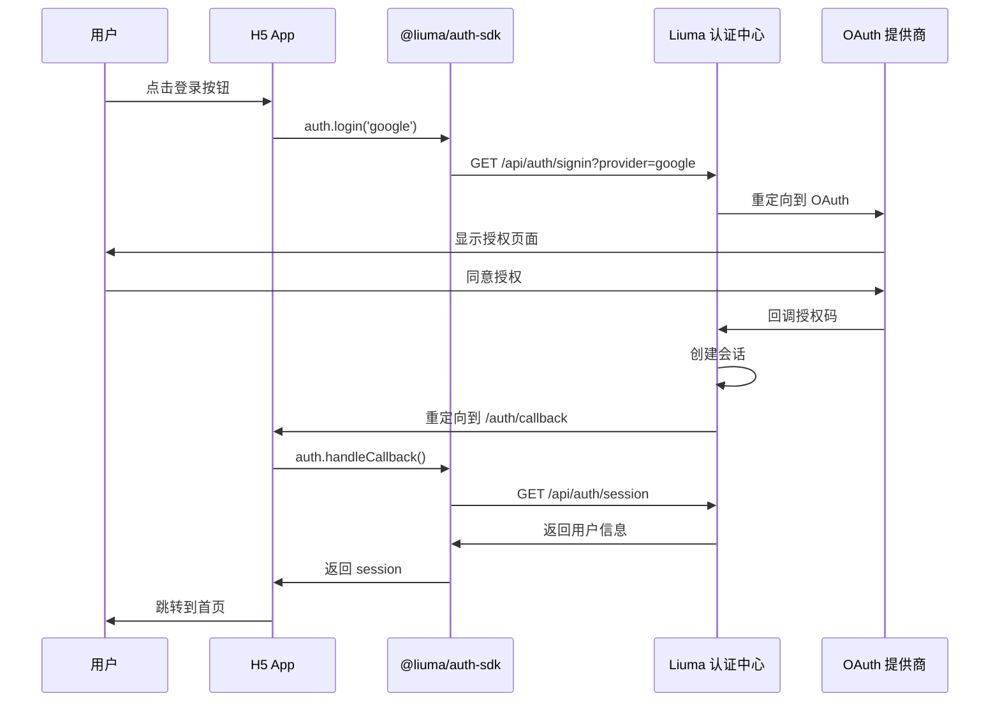
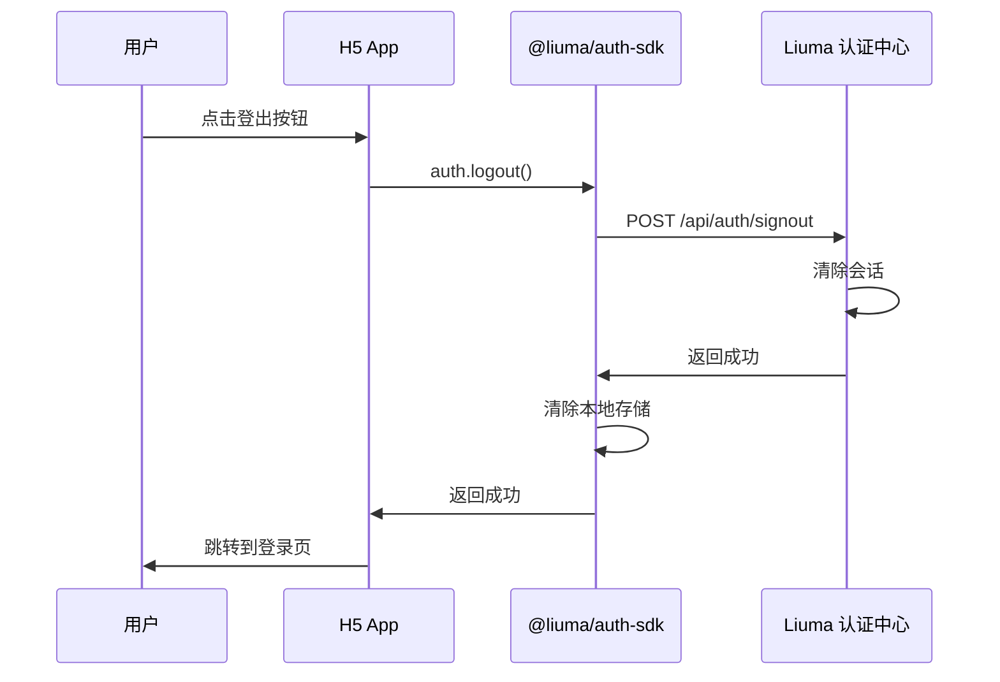

# OpenClaw 认证集成设计文档

> **版本**: v1.0
> **日期**: 2025-02-26
> **状态**: 实施阶段
> **相关文档**:
> - [方案总结](./auth-and-multihost-solution-summary.md)
> - [Liuma 认证中心设计](../../liuma/docs/auth/unified-auth-center-design.md)
> - [SDK 技术设计](../../liuma/docs/auth/auth-sdk-design.md)

---

## 目录

1. [概述](#概述)
2. [移动端 H5 集成设计](#移动端-h5-集成设计)
3. [PC 端集成设计](#pc-端集成设计)
4. [主机配置管理 UI 设计](#主机配置管理-ui-设计)
5. [离线支持设计](#离线支持设计)
6. [安全考虑](#安全考虑)
7. [实施计划](#实施计划)

---

## 概述

### 目标

为 OpenClaw 项目的移动端 H5 和 PC 端（multi-tenant）集成 Liuma 统一认证中心，实现：

1. **统一认证**：使用 Liuma OAuth 2.0 登录
2. **多主机管理**：用户可以配置和管理多个 OpenClaw Gateway
3. **跨设备同步**：主机配置在用户的所有设备间同步
4. **离线支持**：移动端支持离线访问已配置的主机
5. **健康检查**：实时监控主机可用性状态

### 集成架构

```
┌─────────────────────────────────────────────────────────────────────────────┐
│                        OpenClaw 认证集成架构                              │
├─────────────────────────────────────────────────────────────────────────────┤
│                                                                             │
│  ┌─────────────────────────────────────────────────────────────────────┐   │
│  │         Liuma 认证中心 (https://auth.liuma.app)                      │   │
│  │  • 用户认证 (OAuth 2.0)                                             │   │
│  │  • 主机配置存储与同步                                                │   │
│  │  • 健康检查服务                                                      │   │
│  └─────────────────────────────────────────────────────────────────────┘   │
│                                      ▲                                    │
│                                      │ REST API                           │
│           ┌──────────────────────────┴──────────────────────────┐         │
│           │                          │                          │         │
│           ▼                          ▼                          ▼         │
│  ┌─────────────┐            ┌─────────────┐                                             │
│  │ 移动端 H5   │            │  PC 端 Web  │                                             │
│  │ (app-h5)    │            │(multi-tenant)│                                            │
│  │             │            │             │                                             │
│  │┌───────────┐│            │┌───────────┐│                                             │
│  ││@liuma/    ││            ││@liuma/    ││                                             │
│  ││auth-sdk   ││            ││auth-sdk   ││                                             │
│  │└───────────┘│            │└───────────┘│                                             │
│  │             │            │             │                                             │
│  │• 登录页面  │            │• 主机管理  │                                             │
│  │• 主机列表  │            │• 健康状态  │                                             │
│  │• 离线支持  │            │• 设置界面  │                                             │
│  └─────────────┘            └─────────────┘                                             │
│                                                                             │
└─────────────────────────────────────────────────────────────────────────────┘
```

---

## 移动端 H5 集成设计

### 文件结构

```
src/canvas-host/app-h5/
├── lib/
│   └── auth.ts                    # SDK 初始化与配置
├── app/
│   ├── (auth)/
│   │   ├── login/
│   │   │   └── page.tsx           # 登录页面
│   │   └── callback/
│   │       └── page.tsx           # OAuth 回调处理
│   ├── (main)/
│   │   ├── hosts/
│   │   │   ├── page.tsx           # 主机列表
│   │   │   ├── add/
│   │   │   │   └── page.tsx       # 添加主机
│   │   │   └── [id]/
│   │   │       └── page.tsx       # 主机详情
│   │   └── page.tsx               # 首页
│   └── layout.tsx
├── components/
│   ├── auth/
│   │   ├── LoginForm.tsx          # 登录表单组件
│   │   └── LogoutButton.tsx       # 登出按钮
│   ├── hosts/
│   │   ├── HostList.tsx           # 主机列表组件
│   │   ├── HostCard.tsx           # 主机卡片
│   │   ├── AddHostForm.tsx        # 添加主机表单
│   │   ├── HostStatusBadge.tsx    # 主机状态徽章
│   │   └── SyncButton.tsx         # 同步按钮
│   └── offline/
│       └── OfflineBanner.tsx      # 离线提示横幅
└── hooks/
    ├── useAuth.ts                 # 认证状态 Hook
    └── useHosts.ts                # 主机列表 Hook
```

### SDK 初始化

```typescript
// src/canvas-host/app-h5/lib/auth.ts

import { LiumaAuth } from '@liuma/auth-sdk';
import type { HostConfig } from '@liuma/auth-sdk';

/**
 * 初始化 Liuma 认证 SDK
 *
 * 环境变量：
 * - NEXT_PUBLIC_AUTH_CENTER_URL: 认证中心 URL
 * - NEXT_PUBLIC_APP_ID: 应用 ID
 */
export const auth = new LiumaAuth({
  authCenterUrl: process.env.NEXT_PUBLIC_AUTH_CENTER_URL || 'https://auth.liuma.app',
  appId: process.env.NEXT_PUBLIC_APP_ID || 'openclaw-h5',
  redirectUri: typeof window !== 'undefined'
    ? window.location.origin + '/auth/callback'
    : '',
  debug: process.env.NODE_ENV === 'development',
  storagePrefix: 'liuma-h5',
  offlineMode: true,  // 启用离线支持
});

// 认证辅助函数
export async function login(provider: 'google' | 'github' | 'microsoft' = 'google') {
  await auth.login(provider);
}

export async function logout() {
  await auth.logout();
}

export async function getCurrentSession() {
  return auth.getSession();
}

// 主机配置辅助函数
export async function getHosts(): Promise<HostConfig[]> {
  return auth.getHosts();
}

export async function addHost(host: Omit<HostConfig, 'id' | 'userId'>) {
  return auth.addHost(host);
}

export async function removeHost(id: string) {
  return auth.removeHost(id);
}

export async function updateHost(id: string, updates: Partial<HostConfig>) {
  return auth.updateHost(id, updates);
}

export async function setDefaultHost(id: string) {
  return auth.setDefaultHost(id);
}

export async function syncHosts(): Promise<HostConfig[]> {
  return auth.syncHosts();
}

export async function checkHostHealth(url: string): Promise<'online' | 'offline' | 'unknown'> {
  return auth.checkHostHealth(url);
}
```

### 认证流程

#### 登录流程



#### 登出流程



### 页面实现

#### 登录页面 (`app/(auth)/login/page.tsx`)

```typescript
'use client';

import { LoginForm } from '@/components/auth/LoginForm';

export default function LoginPage() {
  return (
    <div className="flex min-h-screen items-center justify-center bg-gradient-to-br from-blue-50 to-indigo-100 p-4">
      <div className="w-full max-w-md">
        <div className="mb-8 text-center">
          <h1 className="text-3xl font-bold text-gray-900">OpenClaw</h1>
          <p className="mt-2 text-sm text-gray-600">移动控制中心</p>
        </div>
        <LoginForm />
      </div>
    </div>
  );
}
```

#### 登录表单组件 (`components/auth/LoginForm.tsx`)

```typescript
'use client';

import { useState } from 'react';
import { useAuth } from '@/hooks/useAuth';

export function LoginForm() {
  const { login, loading } = useAuth();
  const [error, setError] = useState<string>();

  const handleLogin = async (provider: 'google' | 'github' | 'microsoft') => {
    try {
      setError(undefined);
      await login(provider);
    } catch (err) {
      setError(err instanceof Error ? err.message : '登录失败');
    }
  };

  return (
    <div className="space-y-4 rounded-lg bg-white p-8 shadow-lg">
      <h2 className="text-xl font-semibold text-gray-900">登录</h2>

      {error && (
        <div className="rounded-md bg-red-50 p-3 text-sm text-red-800">
          {error}
        </div>
      )}

      <div className="space-y-2">
        <button
          onClick={() => handleLogin('google')}
          disabled={loading}
          className="flex w-full items-center justify-center gap-2 rounded-lg border border-gray-300 bg-white px-4 py-2 text-sm font-medium text-gray-700 hover:bg-gray-50 disabled:opacity-50"
        >
          <svg className="h-5 w-5" viewBox="0 0 24 24">
            <path fill="currentColor" d="M22.56 12.25c0-.78-.07-1.53-.2-2.25H12v4.26h5.92c-.26 1.37-1.04 2.53-2.21 3.31v2.77h3.57c2.08-1.92 3.28-4.74 3.28-8.09z"/>
            <path fill="currentColor" d="M12 23c2.97 0 5.46-.98 7.28-2.66l-3.57-2.77c-.98.66-2.23 1.06-3.71 1.06-2.86 0-5.29-1.93-6.16-4.53H2.18v2.84C3.99 20.53 7.7 23 12 23z"/>
            <path fill="currentColor" d="M5.84 14.09c-.22-.66-.35-1.36-.35-2.09s.13-1.43.35-2.09V7.07H2.18C1.43 8.55 1 10.22 1 12s.43 3.45 1.18 4.93l2.85-2.22.81-.62z"/>
            <path fill="currentColor" d="M12 5.38c1.62 0 3.06.56 4.21 1.64l3.15-3.15C17.45 2.09 14.97 1 12 1 7.7 1 3.99 3.47 2.18 7.07l3.66 2.84c.87-2.6 3.3-4.53 6.16-4.53z"/>
          </svg>
          使用 Google 登录
        </button>

        <button
          onClick={() => handleLogin('github')}
          disabled={loading}
          className="flex w-full items-center justify-center gap-2 rounded-lg border border-gray-300 bg-white px-4 py-2 text-sm font-medium text-gray-700 hover:bg-gray-50 disabled:opacity-50"
        >
          <svg className="h-5 w-5" fill="currentColor" viewBox="0 0 24 24">
            <path d="M12 0c-6.626 0-12 5.373-12 12 0 5.302 3.438 9.8 8.207 11.387.599.111.793-.261.793-.577v-2.234c-3.338.726-4.033-1.416-4.033-1.416-.546-1.387-1.333-1.756-1.333-1.756-1.089-.745.083-.729.083-.729 1.205.084 1.839 1.237 1.839 1.237 1.07 1.834 2.807 1.304 3.492.997.107-.775.418-1.305.762-1.604-2.665-.305-5.467-1.334-5.467-5.931 0-1.311.469-2.381 1.236-3.221-.124-.303-.535-1.524.117-3.176 0 0 1.008-.322 3.301 1.23.957-.266 1.983-.399 3.003-.404 1.02.005 2.047.138 3.006.404 2.291-1.552 3.297-1.23 3.297-1.23.653 1.653.242 2.874.118 3.176.77.84 1.235 1.911 1.235 3.221 0 4.609-2.807 5.624-5.479 5.921.43.372.823 1.102.823 2.222v3.293c0 .319.192.694.801.576 4.765-1.589 8.199-6.086 8.199-11.386 0-6.627-5.373-12-12-12z"/>
          </svg>
          使用 GitHub 登录
        </button>
      </div>
    </div>
  );
}
```

#### OAuth 回调处理 (`app/(auth)/callback/page.tsx`)

```typescript
'use client';

import { useEffect, useState } from 'react';
import { useRouter } from 'next/navigation';
import { auth } from '@/lib/auth';

export default function CallbackPage() {
  const router = useRouter();
  const [status, setStatus] = useState<'loading' | 'success' | 'error'>('loading');

  useEffect(() => {
    const handleCallback = async () => {
      try {
        // SDK 会自动处理 URL 中的授权码
        const session = await auth.getSession();

        if (session?.user) {
          setStatus('success');
          setTimeout(() => {
            router.push('/');
          }, 500);
        } else {
          setStatus('error');
          setTimeout(() => {
            router.push('/login');
          }, 2000);
        }
      } catch (error) {
        console.error('Callback error:', error);
        setStatus('error');
        setTimeout(() => {
          router.push('/login');
        }, 2000);
      }
    };

    handleCallback();
  }, [router]);

  return (
    <div className="flex min-h-screen items-center justify-center">
      {status === 'loading' && (
        <div className="text-center">
          <div className="mb-4 h-8 w-8 animate-spin rounded-full border-4 border-gray-300 border-t-blue-600" />
          <p className="text-sm text-gray-600">正在登录...</p>
        </div>
      )}
      {status === 'success' && (
        <div className="text-center">
          <div className="mb-4 text-green-600">
            <svg className="mx-auto h-12 w-12" fill="none" stroke="currentColor" viewBox="0 0 24 24">
              <path strokeLinecap="round" strokeLinejoin="round" strokeWidth={2} d="M5 13l4 4L19 7" />
            </svg>
          </div>
          <p className="text-sm text-gray-600">登录成功！</p>
        </div>
      )}
      {status === 'error' && (
        <div className="text-center">
          <div className="mb-4 text-red-600">
            <svg className="mx-auto h-12 w-12" fill="none" stroke="currentColor" viewBox="0 0 24 24">
              <path strokeLinecap="round" strokeLinejoin="round" strokeWidth={2} d="M6 18L18 6M6 6l12 12" />
            </svg>
          </div>
          <p className="text-sm text-gray-600">登录失败，即将返回...</p>
        </div>
      )}
    </div>
  );
}
```

#### 主机列表页面 (`app/(main)/hosts/page.tsx`)

```typescript
'use client';

import { useHosts } from '@/hooks/useHosts';
import { HostList } from '@/components/hosts/HostList';
import { SyncButton } from '@/components/hosts/SyncButton';
import { OfflineBanner } from '@/components/offline/OfflineBanner';

export default function HostsPage() {
  const { hosts, loading, sync } = useHosts();

  return (
    <div className="min-h-screen bg-gray-50">
      <OfflineBanner />

      <header className="bg-white shadow-sm">
        <div className="mx-auto max-w-7xl px-4 py-4 sm:px-6 lg:px-8">
          <div className="flex items-center justify-between">
            <h1 className="text-xl font-semibold text-gray-900">我的设备</h1>
            <SyncButton onSync={sync} />
          </div>
        </div>
      </header>

      <main className="mx-auto max-w-7xl px-4 py-6 sm:px-6 lg:px-8">
        {loading ? (
          <div className="flex justify-center py-12">
            <div className="h-8 w-8 animate-spin rounded-full border-4 border-gray-300 border-t-blue-600" />
          </div>
        ) : (
          <HostList hosts={hosts} />
        )}
      </main>
    </div>
  );
}
```

### 自定义 Hooks

#### useAuth Hook

```typescript
// src/hooks/useAuth.ts

import { useEffect, useState } from 'react';
import { auth } from '@/lib/auth';
import type { Session, User } from '@liuma/auth-sdk';

interface UseAuthReturn {
  user: User | null;
  loading: boolean;
  isAuthenticated: boolean;
  login: (provider?: 'google' | 'github' | 'microsoft') => Promise<void>;
  logout: () => Promise<void>;
}

export function useAuth(): UseAuthReturn {
  const [session, setSession] = useState<Session | null>(null);
  const [loading, setLoading] = useState(true);

  useEffect(() => {
    const loadSession = async () => {
      try {
        const data = await auth.getSession();
        setSession(data);
      } catch (error) {
        console.error('Failed to load session:', error);
      } finally {
        setLoading(false);
      }
    };

    loadSession();
  }, []);

  const login = async (provider: 'google' | 'github' | 'microsoft' = 'google') => {
    await auth.login(provider);
  };

  const logout = async () => {
    await auth.logout();
    setSession(null);
  };

  return {
    user: session?.user || null,
    loading,
    isAuthenticated: !!session?.user,
    login,
    logout,
  };
}
```

#### useHosts Hook

```typescript
// src/hooks/useHosts.ts

import { useEffect, useState } from 'react';
import { auth } from '@/lib/auth';
import type { HostConfig } from '@liuma/auth-sdk';

interface UseHostsReturn {
  hosts: HostConfig[];
  loading: boolean;
  addHost: (host: Omit<HostConfig, 'id' | 'userId'>) => Promise<void>;
  removeHost: (id: string) => Promise<void>;
  updateHost: (id: string, updates: Partial<HostConfig>) => Promise<void>;
  setDefaultHost: (id: string) => Promise<void>;
  sync: () => Promise<void>;
  checkHealth: (url: string) => Promise<'online' | 'offline' | 'unknown'>;
}

export function useHosts(): UseHostsReturn {
  const [hosts, setHosts] = useState<HostConfig[]>([]);
  const [loading, setLoading] = useState(true);

  const loadHosts = async () => {
    setLoading(true);
    try {
      const data = await auth.getHosts();
      setHosts(data);
    } catch (error) {
      console.error('Failed to load hosts:', error);
    } finally {
      setLoading(false);
    }
  };

  useEffect(() => {
    loadHosts();
  }, []);

  const addHost = async (host: Omit<HostConfig, 'id' | 'userId'>) => {
    const newHost = await auth.addHost(host);
    setHosts([...hosts, newHost]);
  };

  const removeHost = async (id: string) => {
    await auth.removeHost(id);
    setHosts(hosts.filter(h => h.id !== id));
  };

  const updateHost = async (id: string, updates: Partial<HostConfig>) => {
    const updated = await auth.updateHost(id, updates);
    setHosts(hosts.map(h => h.id === id ? updated : h));
  };

  const setDefaultHost = async (id: string) => {
    await auth.setDefaultHost(id);
    await loadHosts();
  };

  const sync = async () => {
    const synced = await auth.syncHosts();
    setHosts(synced);
  };

  const checkHealth = async (url: string) => {
    return auth.checkHostHealth(url);
  };

  return {
    hosts,
    loading,
    addHost,
    removeHost,
    updateHost,
    setDefaultHost,
    sync,
    checkHealth,
  };
}
```

### 组件实现

#### 主机列表组件 (`components/hosts/HostList.tsx`)

```typescript
'use client';

import { HostConfig } from '@liuma/auth-sdk';
import { HostCard } from './HostCard';
import { AddHostButton } from './AddHostButton';

interface HostListProps {
  hosts: HostConfig[];
}

export function HostList({ hosts }: HostListProps) {
  if (hosts.length === 0) {
    return (
      <div className="text-center py-12">
        <svg
          className="mx-auto h-12 w-12 text-gray-400"
          fill="none"
          stroke="currentColor"
          viewBox="0 0 24 24"
        >
          <path
            strokeLinecap="round"
            strokeLinejoin="round"
            strokeWidth={2}
            d="M9.75 17L9 20l-1 1h8l-1-1-.75-3M3 13h18M5 17h14a2 2 0 002-2V5a2 2 0 00-2-2H5a2 2 0 00-2 2v10a2 2 0 002 2z"
          />
        </svg>
        <h3 className="mt-2 text-sm font-medium text-gray-900">暂无设备</h3>
        <p className="mt-1 text-sm text-gray-500">添加您的第一个 OpenClaw Gateway</p>
        <div className="mt-6">
          <AddHostButton />
        </div>
      </div>
    );
  }

  return (
    <div className="space-y-3">
      {hosts.map((host) => (
        <HostCard key={host.id} host={host} />
      ))}
      <AddHostButton />
    </div>
  );
}
```

#### 主机卡片组件 (`components/hosts/HostCard.tsx`)

```typescript
'use client';

import { useState } from 'react';
import { HostConfig } from '@liuma/auth-sdk';
import { HostStatusBadge } from './HostStatusBadge';
import { useHosts } from '@/hooks/useHosts';

interface HostCardProps {
  host: HostConfig;
}

export function HostCard({ host }: HostCardProps) {
  const { removeHost, setDefaultHost, checkHealth } = useHosts();
  const [health, setHealth] = useState<'online' | 'offline' | 'unknown'>('unknown');
  const [checking, setChecking] = useState(false);

  const handleCheckHealth = async () => {
    setChecking(true);
    try {
      const status = await checkHealth(host.url);
      setHealth(status);
    } finally {
      setChecking(false);
    }
  };

  return (
    <div className="rounded-lg bg-white p-4 shadow-sm ring-1 ring-gray-900/5">
      <div className="flex items-start justify-between">
        <div className="flex-1">
          <div className="flex items-center gap-2">
            <h3 className="font-medium text-gray-900">{host.name}</h3>
            {host.isDefault && (
              <span className="inline-flex items-center rounded-md bg-blue-50 px-2 py-1 text-xs font-medium text-blue-700 ring-1 ring-inset ring-blue-700/10">
                默认
              </span>
            )}
            <HostStatusBadge status={health} />
          </div>
          <p className="mt-1 text-sm text-gray-500">{host.url}</p>
          {host.description && (
            <p className="mt-1 text-sm text-gray-600">{host.description}</p>
          )}
        </div>
        <div className="flex gap-2">
          <button
            onClick={handleCheckHealth}
            disabled={checking}
            className="rounded-md bg-white px-3 py-1.5 text-sm font-medium text-gray-700 shadow-sm ring-1 ring-inset ring-gray-300 hover:bg-gray-50 disabled:opacity-50"
          >
            {checking ? '检查中...' : '检查状态'}
          </button>
          {!host.isDefault && (
            <button
              onClick={() => setDefaultHost(host.id)}
              className="rounded-md bg-white px-3 py-1.5 text-sm font-medium text-gray-700 shadow-sm ring-1 ring-inset ring-gray-300 hover:bg-gray-50"
            >
              设为默认
            </button>
          )}
          <button
            onClick={() => removeHost(host.id)}
            className="rounded-md bg-red-50 px-3 py-1.5 text-sm font-medium text-red-700 shadow-sm ring-1 ring-inset ring-red-300 hover:bg-red-100"
          >
            删除
          </button>
        </div>
      </div>
    </div>
  );
}
```

#### 主机状态徽章 (`components/hosts/HostStatusBadge.tsx`)

```typescript
'use client';

interface HostStatusBadgeProps {
  status: 'online' | 'offline' | 'unknown';
}

export function HostStatusBadge({ status }: HostStatusBadgeProps) {
  const styles = {
    online: 'bg-green-50 text-green-700 ring-green-600/20',
    offline: 'bg-red-50 text-red-700 ring-red-600/20',
    unknown: 'bg-gray-50 text-gray-700 ring-gray-600/20',
  };

  const labels = {
    online: '在线',
    offline: '离线',
    unknown: '未知',
  };

  return (
    <span className={`inline-flex items-center rounded-md px-2 py-1 text-xs font-medium ring-1 ring-inset ${styles[status]}`}>
      {labels[status]}
    </span>
  );
}
```

#### 添加主机表单 (`components/hosts/AddHostForm.tsx`)

```typescript
'use client';

import { useState } from 'react';
import { useHosts } from '@/hooks/useHosts';
import type { HostConfig } from '@liuma/auth-sdk';

interface AddHostFormProps {
  onClose?: () => void;
}

export function AddHostForm({ onClose }: AddHostFormProps) {
  const { addHost } = useHosts();
  const [submitting, setSubmitting] = useState(false);
  const [error, setError] = useState<string>();

  const handleSubmit = async (e: React.FormEvent<HTMLFormElement>) => {
    e.preventDefault();
    setSubmitting(true);
    setError(undefined);

    const formData = new FormData(e.currentTarget);
    const data = {
      name: formData.get('name') as string,
      url: formData.get('url') as string,
      description: formData.get('description') as string || undefined,
    };

    try {
      // 验证 URL 格式
      let url = data.url;
      if (!url.startsWith('http://') && !url.startsWith('https://')) {
        url = `https://${url}`;
      }

      await addHost({
        name: data.name,
        url,
        description: data.description,
      });

      onClose?.();
    } catch (err) {
      setError(err instanceof Error ? err.message : '添加失败');
    } finally {
      setSubmitting(false);
    }
  };

  return (
    <form onSubmit={handleSubmit} className="space-y-4">
      <div>
        <label htmlFor="name" className="block text-sm font-medium text-gray-700">
          设备名称
        </label>
        <input
          type="text"
          name="name"
          id="name"
          required
          placeholder="例如：家里的小主机"
          className="mt-1 block w-full rounded-md border-gray-300 shadow-sm focus:border-blue-500 focus:ring-blue-500 sm:text-sm"
        />
      </div>

      <div>
        <label htmlFor="url" className="block text-sm font-medium text-gray-700">
          设备地址
        </label>
        <input
          type="text"
          name="url"
          id="url"
          required
          placeholder="例如：openclaw.local 或 https://openclaw.example.com"
          className="mt-1 block w-full rounded-md border-gray-300 shadow-sm focus:border-blue-500 focus:ring-blue-500 sm:text-sm"
        />
        <p className="mt-1 text-xs text-gray-500">
          输入设备的域名或 IP 地址
        </p>
      </div>

      <div>
        <label htmlFor="description" className="block text-sm font-medium text-gray-700">
          描述（可选）
        </label>
        <textarea
          name="description"
          id="description"
          rows={3}
          placeholder="添加一些备注..."
          className="mt-1 block w-full rounded-md border-gray-300 shadow-sm focus:border-blue-500 focus:ring-blue-500 sm:text-sm"
        />
      </div>

      {error && (
        <div className="rounded-md bg-red-50 p-3 text-sm text-red-800">
          {error}
        </div>
      )}

      <div className="flex justify-end gap-2">
        <button
          type="button"
          onClick={onClose}
          className="rounded-md bg-white px-4 py-2 text-sm font-medium text-gray-700 shadow-sm ring-1 ring-inset ring-gray-300 hover:bg-gray-50"
        >
          取消
        </button>
        <button
          type="submit"
          disabled={submitting}
          className="rounded-md bg-blue-600 px-4 py-2 text-sm font-medium text-white shadow-sm hover:bg-blue-700 disabled:opacity-50"
        >
          {submitting ? '添加中...' : '添加'}
        </button>
      </div>
    </form>
  );
}
```

#### 同步按钮 (`components/hosts/SyncButton.tsx`)

```typescript
'use client';

import { useState } from 'react';

interface SyncButtonProps {
  onSync: () => Promise<void>;
}

export function SyncButton({ onSync }: SyncButtonProps) {
  const [syncing, setSyncing] = useState(false);

  const handleSync = async () => {
    setSyncing(true);
    try {
      await onSync();
    } finally {
      setSyncing(false);
    }
  };

  return (
    <button
      onClick={handleSync}
      disabled={syncing}
      className="inline-flex items-center gap-2 rounded-md bg-white px-3 py-2 text-sm font-medium text-gray-700 shadow-sm ring-1 ring-inset ring-gray-300 hover:bg-gray-50 disabled:opacity-50"
    >
      <svg
        className={`h-4 w-4 ${syncing ? 'animate-spin' : ''}`}
        fill="none"
        stroke="currentColor"
        viewBox="0 0 24 24"
      >
        <path
          strokeLinecap="round"
          strokeLinejoin="round"
          strokeWidth={2}
          d="M4 4v5h.582m15.356 2A8.001 8.001 0 004.582 9m0 0H9m11 11v-5h-.581m0 0a8.003 8.003 0 01-15.357-2m15.357 2H15"
        />
      </svg>
      {syncing ? '同步中...' : '同步'}
    </button>
  );
}
```

#### 离线提示横幅 (`components/offline/OfflineBanner.tsx`)

```typescript
'use client';

import { useEffect, useState } from 'react';

export function OfflineBanner() {
  const [isOnline, setIsOnline] = useState(true);

  useEffect(() => {
    setIsOnline(navigator.onLine);

    const handleOnline = () => setIsOnline(true);
    const handleOffline = () => setIsOnline(false);

    window.addEventListener('online', handleOnline);
    window.addEventListener('offline', handleOffline);

    return () => {
      window.removeEventListener('online', handleOnline);
      window.removeEventListener('offline', handleOffline);
    };
  }, []);

  if (isOnline) return null;

  return (
    <div className="bg-yellow-50 px-4 py-2 text-center text-sm text-yellow-800">
      <div className="flex items-center justify-center gap-2">
        <svg className="h-4 w-4" fill="none" stroke="currentColor" viewBox="0 0 24 24">
          <path
            strokeLinecap="round"
            strokeLinejoin="round"
            strokeWidth={2}
            d="M18.364 5.636a9 9 0 010 12.728m0 0l-2.829-2.829m2.829 2.829L21 21M15.536 8.464a5 5 0 010 7.072m0 0l-2.829-2.829m-4.243 2.829a4.978 4.978 0 01-1.414-2.83m-1.414 5.658a9 9 0 01-2.167-9.238m7.824 2.167a1 1 0 111.414 1.414m-1.414-1.414L3 3m8.293 8.293l1.414 1.414"
          />
        </svg>
        <span>网络离线，仅显示本地缓存的数据</span>
      </div>
    </div>
  );
}
```

### 环境变量配置

```bash
# .env.local

# Liuma 认证中心配置
NEXT_PUBLIC_AUTH_CENTER_URL=https://auth.liuma.app
NEXT_PUBLIC_APP_ID=openclaw-h5

# 开发环境（可选）
# NEXT_PUBLIC_AUTH_CENTER_URL=http://localhost:3000
```

---

## PC 端集成设计

### 文件结构

```
multi-tenant/frontend/
├── src/
│   ├── lib/
│   │   └── auth.ts                  # SDK 初始化（Server Actions）
│   ├── app/
│   │   ├── (auth)/
│   │   │   ├── login/
│   │   │   │   └── page.tsx         # 登录页面
│   │   │   └── callback/
│   │   │       └── page.tsx         # OAuth 回调
│   │   ├── dashboard/
│   │   │   ├── settings/
│   │   │   │   ├── hosts/
│   │   │   │   │   ├── page.tsx     # 主机管理页面
│   │   │   │   │   └── components/
│   │   │   │   │       ├── HostTable.tsx
│   │   │   │   │       ├── AddHostDialog.tsx
│   │   │   │   │       └── HostHealthIndicator.tsx
│   │   │   │   └── page.tsx         # 设置页面
│   │   │   └── page.tsx             # 仪表板
│   │   └── layout.tsx
│   └── components/
│       ├── auth/
│       │   ├── UserMenu.tsx         # 用户菜单
│       │   └── LogoutButton.tsx
│       └── hosts/
│           └── HostStatusCard.tsx   # 主机状态卡片
└── package.json
```

### SDK 初始化（Server Actions）

```typescript
// multi-tenant/frontend/src/lib/auth.ts

'use server';

import { LiumaAuth } from '@liuma/auth-sdk/server';
import type { HostConfig, Session } from '@liuma/auth-sdk';

export const auth = new LiumaAuth({
  authCenterUrl: process.env.AUTH_CENTER_URL || 'https://auth.liuma.app',
  appId: process.env.APP_ID || 'openclaw-pc',
  redirectUri: `${process.env.NEXT_PUBLIC_BASE_URL}/auth/callback`,
});

// Server Actions
export async function getServerSession(): Promise<Session | null> {
  return auth.getSession();
}

export async function getHostConfigs(): Promise<HostConfig[]> {
  const session = await auth.getSession();
  if (!session?.user) {
    throw new Error('Unauthorized');
  }
  return auth.getHosts();
}

export async function addHostConfig(
  host: Omit<HostConfig, 'id' | 'userId'>
): Promise<HostConfig> {
  const session = await auth.getSession();
  if (!session?.user) {
    throw new Error('Unauthorized');
  }
  return auth.addHost(host);
}

export async function removeHostConfig(id: string): Promise<void> {
  const session = await auth.getSession();
  if (!session?.user) {
    throw new Error('Unauthorized');
  }
  return auth.removeHost(id);
}

export async function updateHostConfig(
  id: string,
  updates: Partial<HostConfig>
): Promise<HostConfig> {
  const session = await auth.getSession();
  if (!session?.user) {
    throw new Error('Unauthorized');
  }
  return auth.updateHost(id, updates);
}

export async function setDefaultHostConfig(id: string): Promise<void> {
  const session = await auth.getSession();
  if (!session?.user) {
    throw new Error('Unauthorized');
  }
  return auth.setDefaultHost(id);
}

export async function syncHostConfigs(): Promise<HostConfig[]> {
  const session = await auth.getSession();
  if (!session?.user) {
    throw new Error('Unauthorized');
  }
  return auth.syncHosts();
}

export async function checkHostConfigHealth(
  url: string
): Promise<'online' | 'offline' | 'unknown'> {
  return auth.checkHostHealth(url);
}

export async function logoutUser(): Promise<void> {
  return auth.logout();
}
```

### 用户菜单组件 (`components/auth/UserMenu.tsx`)

```typescript
'use client';

import { useState } from 'react';
import { getServerSession, logoutUser } from '@/lib/auth';

interface User {
  id: string;
  name: string;
  email: string;
  image?: string;
}

export function UserMenu({ user }: { user: User }) {
  const [open, setOpen] = useState(false);

  const handleLogout = async () => {
    await logoutUser();
    window.location.href = '/login';
  };

  return (
    <div className="relative">
      <button
        onClick={() => setOpen(!open)}
        className="flex items-center gap-2 rounded-md px-3 py-2 text-sm font-medium text-gray-700 hover:bg-gray-100"
      >
        {user.image ? (
          
        ) : (
          <div className="flex h-8 w-8 items-center justify-center rounded-full bg-blue-600 text-sm font-medium text-white">
            {user.name.charAt(0).toUpperCase()}
          </div>
        )}
        <span>{user.name}</span>
      </button>

      {open && (
        <>
          <div
            className="fixed inset-0 z-10"
            onClick={() => setOpen(false)}
          />
          <div className="absolute right-0 z-20 mt-2 w-56 rounded-md bg-white shadow-lg ring-1 ring-gray-900/5">
            <div className="px-4 py-3 border-b border-gray-100">
              <p className="text-sm font-medium text-gray-900">{user.name}</p>
              <p className="text-sm text-gray-500">{user.email}</p>
            </div>
            <div className="py-1">
              <a
                href="/dashboard/settings"
                className="block px-4 py-2 text-sm text-gray-700 hover:bg-gray-100"
              >
                设置
              </a>
              <button
                onClick={handleLogout}
                className="block w-full px-4 py-2 text-left text-sm text-gray-700 hover:bg-gray-100"
              >
                登出
              </button>
            </div>
          </div>
        </>
      )}
    </div>
  );
}
```

### 主机管理页面 (`app/dashboard/settings/hosts/page.tsx`)

```typescript
import { getHostConfigs } from '@/lib/auth';
import { HostTable } from './components/HostTable';

export default async function HostsSettingsPage() {
  const hosts = await getHostConfigs();

  return (
    <div className="space-y-6">
      <div>
        <h1 className="text-2xl font-bold text-gray-900">设备管理</h1>
        <p className="mt-1 text-sm text-gray-500">
          管理您的 OpenClaw Gateway 设备
        </p>
      </div>

      <HostTable initialHosts={hosts} />
    </div>
  );
}
```

### 主机表格组件 (`components/hosts/HostTable.tsx`)

```typescript
'use client';

import { useState } from 'react';
import type { HostConfig } from '@liuma/auth-sdk';
import {
  addHostConfig,
  removeHostConfig,
  updateHostConfig,
  setDefaultHostConfig,
  syncHostConfigs,
  checkHostConfigHealth,
} from '@/lib/auth';
import { AddHostDialog } from './AddHostDialog';
import { HostHealthIndicator } from './HostHealthIndicator';

interface HostTableProps {
  initialHosts: HostConfig[];
}

export function HostTable({ initialHosts }: HostTableProps) {
  const [hosts, setHosts] = useState<HostConfig[]>(initialHosts);
  const [showAddDialog, setShowAddDialog] = useState(false);
  const [syncing, setSyncing] = useState(false);

  const handleAddHost = async (host: Omit<HostConfig, 'id' | 'userId'>) => {
    const newHost = await addHostConfig(host);
    setHosts([...hosts, newHost]);
    setShowAddDialog(false);
  };

  const handleRemoveHost = async (id: string) => {
    await removeHostConfig(id);
    setHosts(hosts.filter(h => h.id !== id));
  };

  const handleSetDefault = async (id: string) => {
    await setDefaultHostConfig(id);
    const updated = await syncHostConfigs();
    setHosts(updated);
  };

  const handleSync = async () => {
    setSyncing(true);
    try {
      const synced = await syncHostConfigs();
      setHosts(synced);
    } finally {
      setSyncing(false);
    }
  };

  return (
    <div className="space-y-4">
      <div className="flex justify-between items-center">
        <h3 className="text-lg font-medium text-gray-900">
          已配置的设备 ({hosts.length})
        </h3>
        <div className="flex gap-2">
          <button
            onClick={handleSync}
            disabled={syncing}
            className="rounded-md bg-white px-4 py-2 text-sm font-medium text-gray-700 shadow-sm ring-1 ring-inset ring-gray-300 hover:bg-gray-50 disabled:opacity-50"
          >
            {syncing ? '同步中...' : '同步'}
          </button>
          <button
            onClick={() => setShowAddDialog(true)}
            className="rounded-md bg-blue-600 px-4 py-2 text-sm font-medium text-white shadow-sm hover:bg-blue-700"
          >
            添加设备
          </button>
        </div>
      </div>

      {hosts.length === 0 ? (
        <div className="text-center py-12 bg-white rounded-lg shadow-sm">
          <p className="text-sm text-gray-500">暂无设备</p>
        </div>
      ) : (
        <div className="overflow-hidden bg-white shadow-sm ring-1 ring-gray-900/5 sm:rounded-lg">
          <table className="min-w-full divide-y divide-gray-300">
            <thead className="bg-gray-50">
              <tr>
                <th className="px-3 py-3.5 text-left text-sm font-semibold text-gray-900">
                  设备名称
                </th>
                <th className="px-3 py-3.5 text-left text-sm font-semibold text-gray-900">
                  地址
                </th>
                <th className="px-3 py-3.5 text-left text-sm font-semibold text-gray-900">
                  状态
                </th>
                <th className="px-3 py-3.5 text-left text-sm font-semibold text-gray-900">
                  默认
                </th>
                <th className="px-3 py-3.5 text-right text-sm font-semibold text-gray-900">
                  操作
                </th>
              </tr>
            </thead>
            <tbody className="divide-y divide-gray-200">
              {hosts.map((host) => (
                <tr key={host.id}>
                  <td className="px-3 py-4 text-sm text-gray-900">
                    {host.name}
                  </td>
                  <td className="px-3 py-4 text-sm text-gray-500">
                    {host.url}
                  </td>
                  <td className="px-3 py-4 text-sm">
                    <HostHealthIndicator url={host.url} />
                  </td>
                  <td className="px-3 py-4 text-sm">
                    {host.isDefault ? (
                      <span className="inline-flex items-center rounded-md bg-blue-50 px-2 py-1 text-xs font-medium text-blue-700 ring-1 ring-inset ring-blue-700/10">
                        默认
                      </span>
                    ) : (
                      <button
                        onClick={() => handleSetDefault(host.id)}
                        className="text-blue-600 hover:text-blue-700"
                      >
                        设为默认
                      </button>
                    )}
                  </td>
                  <td className="px-3 py-4 text-sm text-right">
                    <button
                      onClick={() => handleRemoveHost(host.id)}
                      className="text-red-600 hover:text-red-700"
                    >
                      删除
                    </button>
                  </td>
                </tr>
              ))}
            </tbody>
          </table>
        </div>
      )}

      {showAddDialog && (
        <AddHostDialog
          onClose={() => setShowAddDialog(false)}
          onAdd={handleAddHost}
        />
      )}
    </div>
  );
}
```

### 环境变量配置

```bash
# .env.local

# Liuma 认证中心配置
AUTH_CENTER_URL=https://auth.liuma.app
APP_ID=openclaw-pc

# 应用配置
NEXT_PUBLIC_BASE_URL=https://openclaw.example.com
```

---

## 主机配置管理 UI 设计

### UI 组件层次

```
HostManagement
├── HostList (列表视图)
│   ├── HostCard (卡片视图，移动端)
│   └── HostTable (表格视图，PC 端)
├── HostDetail (详情视图)
│   ├── BasicInfo (基本信息)
│   ├── HealthStatus (健康状态)
│   └── Actions (操作按钮)
└── AddHostForm (添加表单)
    ├── NameInput (设备名称)
    ├── UrlInput (设备地址)
    └── DescriptionInput (描述)
```

### 状态管理

```typescript
// hooks/useHostManagement.ts

import { useState, useCallback } from 'react';
import type { HostConfig } from '@liuma/auth-sdk';
import { useHosts } from './useHosts';

export function useHostManagement() {
  const { hosts, loading, addHost, removeHost, updateHost, setDefaultHost, sync } = useHosts();
  const [selectedHost, setSelectedHost] = useState<HostConfig | null>(null);
  const [isAddDialogOpen, setIsAddDialogOpen] = useState(false);

  const handleAdd = useCallback(async (data: Omit<HostConfig, 'id' | 'userId'>) => {
    await addHost(data);
    setIsAddDialogOpen(false);
  }, [addHost]);

  const handleRemove = useCallback(async (id: string) => {
    if (confirm('确定要删除此设备吗？')) {
      await removeHost(id);
      if (selectedHost?.id === id) {
        setSelectedHost(null);
      }
    }
  }, [removeHost, selectedHost]);

  return {
    hosts,
    loading,
    selectedHost,
    isAddDialogOpen,
    setSelectedHost,
    setIsAddDialogOpen,
    addHost: handleAdd,
    removeHost: handleRemove,
    updateHost,
    setDefaultHost,
    sync,
  };
}
```

---

## 离线支持设计

### IndexedDB 缓存策略

```typescript
// lib/offlineCache.ts

import Dexie, { Table } from 'dexie';

interface CachedHost {
  id: string;
  data: HostConfig;
  timestamp: number;
}

class OfflineDatabase extends Dexie {
  hosts!: Table<CachedHost>;

  constructor() {
    super('openclaw-offline');
    this.version(1).stores({
      hosts: 'id, timestamp',
    });
  }
}

const db = new OfflineDatabase();

export const offlineCache = {
  async getHosts(): Promise<HostConfig[]> {
    const cached = await db.hosts.toArray();
    return cached.map((item) => item.data);
  },

  async setHosts(hosts: HostConfig[]): Promise<void> {
    await db.hosts.clear();
    await db.hosts.bulkAdd(
      hosts.map((host) => ({
        id: host.id,
        data: host,
        timestamp: Date.now(),
      }))
    );
  },

  async updateHost(host: HostConfig): Promise<void> {
    await db.hosts.put({
      id: host.id,
      data: host,
      timestamp: Date.now(),
    });
  },

  async removeHost(id: string): Promise<void> {
    await db.hosts.delete(id);
  },

  async clear(): Promise<void> {
    await db.hosts.clear();
  },
};
```

### 离线检测与回退

```typescript
// hooks/useOfflineSync.ts

import { useEffect, useState } from 'react';
import { auth } from '@/lib/auth';
import { offlineCache } from '@/lib/offlineCache';

export function useOfflineSync() {
  const [isOnline, setIsOnline] = useState(true);
  const [isSyncing, setIsSyncing] = useState(false);

  useEffect(() => {
    const handleOnline = () => {
      setIsOnline(true);
      syncWhenOnline();
    };

    const handleOffline = () => setIsOnline(false);

    window.addEventListener('online', handleOnline);
    window.addEventListener('offline', handleOffline);

    return () => {
      window.removeEventListener('online', handleOnline);
      window.removeEventListener('offline', handleOffline);
    };
  }, []);

  const syncWhenOnline = async () => {
    if (!isOnline || isSyncing) return;

    setIsSyncing(true);
    try {
      // 从服务器拉取最新数据
      const remoteHosts = await auth.getHosts();

      // 更新本地缓存
      await offlineCache.setHosts(remoteHosts);
    } catch (error) {
      console.error('Sync failed:', error);
    } finally {
      setIsSyncing(false);
    }
  };

  const loadHosts = async () => {
    if (isOnline) {
      try {
        return await auth.getHosts();
      } catch (error) {
        // 网络失败，回退到缓存
        console.warn('Network failed, using cache');
        return await offlineCache.getHosts();
      }
    } else {
      // 离线，直接使用缓存
      return await offlineCache.getHosts();
    }
  };

  return {
    isOnline,
    isSyncing,
    loadHosts,
  };
}
```

---

## 安全考虑

### Token 管理

1. **Cookie 存储**：使用 httpOnly Cookie 存储 session token
2. **自动刷新**：SDK 自动处理 token 过期和刷新
3. **安全传输**：所有 API 调用必须通过 HTTPS

### CORS 配置

```typescript
// Liuma 认证中心 CORS 配置
const corsConfig = {
  origin: [
    'https://openclaw.app',
    'http://localhost:3000',  // 开发环境
  ],
  credentials: true,
  methods: ['GET', 'POST', 'PUT', 'DELETE'],
};
```

### 数据验证

```typescript
// 客户端输入验证
function validateHostUrl(url: string): boolean {
  try {
    const parsed = new URL(url.startsWith('http') ? url : `https://${url}`);
    return ['http:', 'https:'].includes(parsed.protocol);
  } catch {
    return false;
  }
}

function validateHostName(name: string): boolean {
  return name.trim().length > 0 && name.length <= 100;
}
```

---

## 实施计划

### Week 6-7: 移动端 H5 集成

**Week 6: 基础集成**
- [ ] 安装和配置 @liuma/auth-sdk
- [ ] 创建 SDK 初始化文件 (`lib/auth.ts`)
- [ ] 实现登录/登出流程
- [ ] 创建 OAuth 回调页面
- [ ] 实现认证状态 Hook (`useAuth`)

**Week 7: 主机管理**
- [ ] 实现主机列表 Hook (`useHosts`)
- [ ] 创建主机列表页面
- [ ] 实现添加/删除/更新主机功能
- [ ] 创建主机状态健康检查
- [ ] 实现离线支持（IndexedDB）
- [ ] 设备测试（真机）

### Week 8-9: PC 端集成

**Week 8: 认证集成**
- [ ] 安装和配置 @liuma/auth-sdk/server
- [ ] 创建 Server Actions (`lib/auth.ts`)
- [ ] 实现服务端认证
- [ ] 创建用户菜单组件
- [ ] 实现登录/登出流程

**Week 9: 主机管理**
- [ ] 实现主机管理页面
- [ ] 创建主机表格组件
- [ ] 实现添加/删除/设置默认主机
- [ ] 实现主机健康检查显示
- [ ] 功能测试

---

## 参考资料

- [Liuma 认证中心 API 文档](../../liuma/docs/auth/unified-auth-center-design.md#api-参考)
- [@liuma/auth-sdk 使用指南](../../liuma/docs/auth/auth-sdk-design.md#使用指南)
- [OpenClaw 认证方案总结](./auth-and-multihost-solution-summary.md)
- [完整实施计划](../../liuma/docs/auth/auth-implementation-plan.md)
